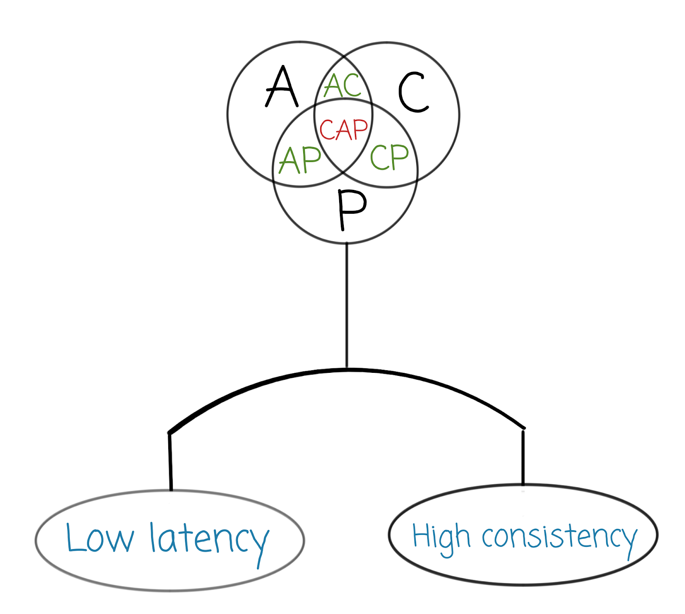

<!--
_class: lead
_paginate: false
_footer: ""
-->

# <!-- fit --> CAP Theorem 101

---
<!--
_class: lead
-->
# Кто я

- 14 лет в IT
- Сначала админ
- Потом разработчик
- И всё это время работаю с распределёнными системами

---

<!-- _class: lead -->
# А что такое распределённые системы:question:

---
# <!-- fit --> А что такое распределённые системы?

> Распределённая система — система, для которой отношения местоположений элементов (или групп элементов) играют существенную роль с точки зрения функционирования системы, а следовательно, и с точки зрения анализа и синтеза системы. 
> -- [Wikipedia][1]

[1]: https://ru.wikipedia.org/wiki/%D0%A0%D0%B0%D1%81%D0%BF%D1%80%D0%B5%D0%B4%D0%B5%D0%BB%D1%91%D0%BD%D0%BD%D0%B0%D1%8F_%D1%81%D0%B8%D1%81%D1%82%D0%B5%D0%BC%D0%B0?oldformat=true

---
<!-- _class: lead -->

# <!-- fit --> :zzz:

---
<!-- _class: lead -->

# <!-- fit --> Попробуем попроще

* Много серверов
* Много сервисов
* **Много процессов!**

---

# И?

**Что-то может пойти не так**

CAP-теорема рассказывает о том, что пойдёт не так и к чему надо готовиться.

Так что же это за волшебные буквы?

---
<!--
_class: lead
_color:  #cd65a5 
-->

# C for Consistency

---
# C for Consistency

ACID:
* Данные соответствуют бизнес-правилам

---
# C for Consistency

ACID:
- Данные соответствуют бизнес-правилам

CAP:
* Все процессы содержат одни и те же данные
* Linearizability

---

---
<!-- _class: lead -->

# <!-- fit --> :stop_sign:Но это НЕ распределённая система

Рассмотрим Postgres :elephant: с асинхронной репликацией

---

---
<!-- _footer: "" -->
# <!-- fit --> Thanks Vlad Mihalcea for these images

They are from his excellent book

You can buy it at https://vladmihalcea.com/books/high-performance-java-persistence/

Also please subscribe to his blog at https://vladmihalcea.com

---
<!-- _class: lead -->
# Consistency

Это когда данные так просто не испортишь потому что всё со всем синхронизировано :smile:

---
# A for Availability

---
# A for Availability

Как думаете, что такое доступность?

---

# A for Availability

Что такое доступность? Ответ должен прийти!

А за сколько? Голосуем!

---
<!-- _class: lead -->
# A for Availability

Ответ должен прийти

**Когда-нибудь**
**Какой-нибудь**

---
# P for «Partition tolerance»

---
### P for «Partition tolerance»

* Сети не бывают идеальными
* Даже если админы говорят иначе
* **Особенно** если админы говорят иначе

---
### P for «Partition tolerance»

- Сети не бывают идеальными
- Даже если админы говорят иначе
- **Особенно** если админы говорят иначе

Partition tolerance — когда система продолжает работать даже если сединения между серверами нет

**Как-нибудь**

---
<!-- _class: lead -->
# Так что же это за теорема?

---

---
<!-- _class: lead -->
# Критика

https://jvns.ca/blog/2016/11/19/a-critique-of-the-cap-theorem/

---

<!-- footer: "" -->

---

# Критика

Критика заключается в том, что CAP-теорема даёт нам мало знания.

Но так ли это? С моей точки зрения нет!

Потому что CAP нам говорит о том, что произойдёт в worst-case scenario!

---

# Например?

* В Postgres с асинхронной репликацией вы получите неконсистентные данные
* С синхронной — не получите вообще
* В RabbitMQ потеряете часть данных, а часть получите много раз
* В кассандре получите не то, что исали

---

<!-- _class: lead -->
# <!-- fit --> Так просто?

---

<!-- _class: lead -->
# <!-- fit --> НЕТ

---

# PACELC

> Теорема PACELC — расширение теоремы CAP, которое гласит, что в случае разделения сети (P) в распределённой компьютерной системе необходимо выбирать между доступностью (A) и согласованностью (C) (согласно теореме CAP), но в любом случае, даже если система работает нормально в отсутствии разделения (E), нужно выбирать между задержками (L) и согласованностью (C). 
> -- [Wikipedia][1]

[1]: https://ru.wikipedia.org/wiki/%D0%A2%D0%B5%D0%BE%D1%80%D0%B5%D0%BC%D0%B0_PACELC?oldformat=true

---

<!--
_theme: white
_background: white
_backgroundImage: "linear-gradient(to bottom, #fff 0%, #fff 50%, #fff 100%)"
_color: black
-->

# PACELC

---

# Выводы?

* Знай CAP теорему
* Знай где твоя система в ней
* Не обманывайся — ты не достигнешь CAP

---

# Что почитать?

* Aphyr
* Тесты Jepsen https://jepsen.com
* Блог Джулии Эванс https://codahale.com/you-cant-sacrifice-partition-tolerance/

---

<!-- _class: lead -->

# Спасибо!

@asm0dey всюду
@asm0di0 
https://newpodcast2.live